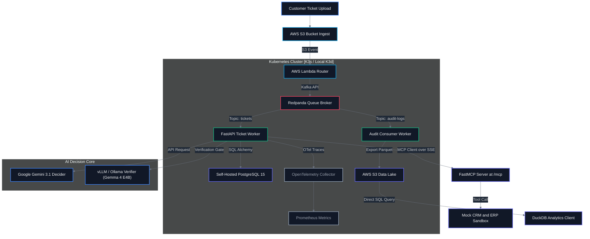

# ⚡ SyncOps AI — Event-Driven Enterprise Agent for Support & Order Fulfillment

<p align="center">
  
  
  
  
  
</p>

<p align="center">
  
  
  
  
</p>

---

## 📖 Table of Contents

- [Problem Statement](#-problem-statement)
- [Solution Overview](#-solution-overview)
- [✨ Novelty Hooks (Architectural Innovations)](#-novelty-hooks-architectural-innovations)
- [💡 Core Features](#-core-features)
- [🏗️ System Architecture](#%EF%B8%8F-system-architecture)
- [🛠️ Technology Stack](#%EF%B8%8F-technology-stack)
- [📂 Project Structure](#-project-structure)
- [💻 Code Highlights](#-code-highlights)
- [🚀 Getting Started & Deployment](#-getting-started--deployment)
- [📊 Prometheus Observability](#-prometheus-observability)
- [🔑 License](#-license)

---

## ⚠️ Problem Statement

Enterprise customer operations and order management are highly manual, error-prone, and expensive. Teams spend hours copying data between customer emails, Customer Relationship Management (CRM) databases, and Enterprise Resource Planning (ERP) shipping systems.

Legacy automation pipelines suffer from:
* **API Race Conditions & Retries**: Simple scripts fail when external systems go offline or reject updates.
* **Hallucinations on Data Write**: Standard LLM integrations can make incorrect updates to shipping quantities or database records.
* **Lack of Audit Trails**: Businesses cannot verify why an AI decided to execute a specific refund or address change.
* **High Operational Costs**: Running heavy servers and paying expensive LLM providers 24/7 drains budget.

---

## 💡 Solution Overview

SyncOps AI orchestrates multiple cloud and AI systems to handle customer tasks autonomously:
* **Serverless Ingestion & Semantic Routing**: Customer tickets trigger **AWS Lambda**, which routes incoming requests into prioritized Kafka topics based on classification risk.
* **Asynchronous Processing**: Python consumers pull tickets off specialized Kafka partitions, allowing independent worker scaling.
* **Multi-LLM Decision Core**: The agent uses **Google Gemini 3.1 Flash-Lite** as the primary decider, with local **vLLM / Ollama** acting as the verifier and extraction core.
* **Zero-Schema vLLM Extraction**: A local **vLLM / Ollama** engine utilizes guided decoding (JSON schema constraint sampling via **Outlines**) to guarantee 100% syntactically valid parameter extraction.
* **Model Context Protocol (MCP) Integration**: Enterprise system updates are decoupled and executed via a dedicated **Model Context Protocol (MCP)** server (implemented using Python's **FastMCP**). The worker functions as an MCP client over Server-Sent Events (SSE) to invoke mock **CRM** (HubSpot/Salesforce) and **ERP** (SAP/Odoo) tools securely.
* **Idempotency Guard**: Downstream database and tool invocation writes use a deterministic idempotency key derived from Kafka metadata: `SHA256(Topic + Partition + Offset)` to prevent double executions (e.g., double-refunds).
* **Parquet Data Lake**: Execution traces and token metrics are serialized as partitioned **Parquet** files on **AWS S3** (or emulated via **LocalStack**) and queried locally for zero cost using **DuckDB**.
* **GitOps & Observability**: Managed via **Terraform**, deployed on **Kubernetes**, and instrumented with **OpenTelemetry** (using GenAI Semantic Conventions) and Prometheus.

---

## ✨ Novelty Hooks (Architectural Innovations)

> [!IMPORTANT]
> ### Hook 1: Self-Correcting Multi-Step Tool Execution Loop
> If the AI agent calls the mock CRM or ERP system and receives an API validation error (e.g., *invalid warehouse code* or *insufficient stock*), it does not crash or escalate to a human. Instead, it reads the raw API error payload, updates its internal context, plans a fallback strategy, and automatically resubmits a corrected call.

> [!TIP]
> ### Hook 2: Dual-Model Consensus Verification Gate
> Before executing high-risk actions (such as triggering an order refund or archiving a customer deal), a verification gate is triggered. The primary decider (**Google Gemini 3.1 Flash-Lite**) must agree on the refund calculation and reason with the verifier running locally (**vLLM / Ollama** running **Gemma 4 E4B**). If there is a disagreement, the transaction is suspended and routed to a human-in-the-loop review queue.

> [!NOTE]
> ### Hook 3: Deterministic Kafka-Coordinates Idempotency (Double-Refund Protection)
> To protect against network dropouts during retry loops, the platform generates a unique, deterministic idempotency key for every action based on the consumer metadata: `SHA256(Topic + Partition + Offset)`. If the ERP/CRM database encounters the same key within a 15-minute window, it suppresses duplicate execution and returns the cached result.

> [!IMPORTANT]
> ### Hook 4: Guided Token Sampling (Zero-Schema Failures)
> Instead of relying on raw prompting for JSON extraction, the local **vLLM** engine employs guided decoding. By integrating with libraries like **Outlines**, the model is constrained at the token selection level to only sample tokens that conform to the target Pydantic schema, guaranteeing syntactically valid outputs.

---

## 💡 Core Features

<table width="100%" style="border-collapse: collapse; border: none;">
  <tr style="border: none;">
    <td width="50%" style="border: none; padding: 15px; vertical-align: top;">
      <div style="background-color: #0d1117; border: 1px solid #30363d; border-radius: 8px; padding: 20px; height: 100%;">
        <h4 style="color: #58a6ff; margin-top: 0;">✉️ Event Ingestion & Semantic Routing</h4>
        <p style="color: #8b949e; font-size: 14px; line-height: 1.5;">S3 uploads trigger AWS Lambda to perform fast ticket classification and routing into partitioned Kafka topics (<code>tickets-critical-write</code> vs <code>tickets-standard-update</code>).</p>
      </div>
    </td>
    <td width="50%" style="border: none; padding: 15px; vertical-align: top;">
      <div style="background-color: #0d1117; border: 1px solid #30363d; border-radius: 8px; padding: 20px; height: 100%;">
        <h4 style="color: #58a6ff; margin-top: 0;">🏢 FastMCP CRM & ERP Server</h4>
        <p style="color: #8b949e; font-size: 14px; line-height: 1.5;">Exposes mock CRM (Salesforce/HubSpot) and ERP (SAP/Odoo) tools (<code>check_inventory</code>, <code>modify_order_address</code>, <code>generate_invoice</code>, <code>process_return</code>, <code>get_customer_profile</code>, <code>modify_deal_stage</code>, <code>upgrade_customer_tier</code>) via a FastMCP server over Server-Sent Events (SSE).</p>
      </div>
    </td>
  </tr>
  <tr style="border: none;">
    <td width="50%" style="border: none; padding: 15px; vertical-align: top;">
      <div style="background-color: #0d1117; border: 1px solid #30363d; border-radius: 8px; padding: 20px; height: 100%;">
        <h4 style="color: #58a6ff; margin-top: 0;">🧬 Guided Token Extraction (vLLM / Ollama)</h4>
        <p style="color: #8b949e; font-size: 14px; line-height: 1.5;">Guided decoding constraint formats unstructured support requests into strict Pydantic JSON schemas via local CPU/GPU execution (Gemma 4 E4B), minimizing API expenses.</p>
      </div>
    </td>
    <td width="50%" style="border: none; padding: 15px; vertical-align: top;">
      <div style="background-color: #0d1117; border: 1px solid #30363d; border-radius: 8px; padding: 20px; height: 100%;">
        <h4 style="color: #58a6ff; margin-top: 0;">📦 Parquet Data Lake + DuckDB</h4>
        <p style="color: #8b949e; font-size: 14px; line-height: 1.5;">Executions are pushed as time-partitioned Parquet files to S3/LocalStack. DuckDB runs serverless SQL queries directly over the lake for zero-cost analytics.</p>
      </div>
    </td>
  </tr>
  <tr style="border: none;">
    <td colspan="2" style="border: none; padding: 15px; vertical-align: top;">
      <div style="background-color: #0d1117; border: 1px solid #30363d; border-radius: 8px; padding: 20px; height: 100%;">
        <h4 style="color: #58a6ff; margin-top: 0;">⚙️ Terraform Ephemeral Staging</h4>
        <p style="color: #8b949e; font-size: 14px; line-height: 1.5;">Automated provisioning script that spins up the AWS staging sandbox, tests the event stream end-to-end, and destroys the resources immediately to keep AWS costs at exactly $0.</p>
      </div>
    </td>
  </tr>
</table>

---

## 🏗️ System Architecture

The following diagram illustrates the event pipeline, Kubernetes boundaries, and data flows:



---

## 🛠️ Technology Stack

| Layer | Technologies Used |
|---|---|
| **Backend & AI** | FastAPI, Python 3.11, Model Context Protocol (MCP) via FastMCP, Google Gemini 3.1 Flash-Lite, vLLM / Ollama (Gemma 4 E4B), SQLAlchemy, PostgreSQL 15, DuckDB |
| **Ingestion** | AWS Lambda, Redpanda (Kafka), AWS S3 |
| **Infrastructure** | Terraform, Kubernetes (K3s/K3d), LocalStack, Docker, Helm |
| **Observability** | OpenTelemetry, Prometheus, Langfuse |

---

## 📂 Project Structure

```
syncops-ai/
├── backend/
│   ├── app/
│   │   ├── main.py                  # FastAPI Server Setup & lifespan
│   │   ├── routers/                 # API controllers
│   │   ├── services/
│   │   │   ├── agent_core.py        # Decider loop (Google Gemini API)
│   │   │   ├── verifier_gate.py     # Verification gate (vLLM / Ollama)
│   │   │   ├── mcp_server.py        # FastMCP Server definition (SyncOps ERP CRM)
│   │   │   ├── mock_crm_erp.py      # Mock Salesforce/SAP API endpoints
│   │   │   ├── extraction.py        # vLLM/Ollama structural parser
│   │   │   ├── dw_exporter.py       # Parquet serializer & S3 exporter
│   │   │   └── dw_query.py          # DuckDB SQL executor over Parquet
│   │   ├── kafka/
│   │   │   ├── producer.py          # Redpanda Event Producer
│   │   │   └── consumers/
│   │   │       ├── ticket_consumer.py # Ingestion processor
│   │   │       └── audit_consumer.py  # Audit logging consumer
│   │   ├── db.py                    # Database connection manager
│   │   └── telemetry.py             # OpenTelemetry setup
│   └── tests/                       # Pytest suite & Testcontainers
├── lambda/
│   └── ticket_ingest/
│       └── index.py                 # Lambda code (reads ticket, triggers Redpanda)
├── infra/
│   ├── terraform/                   # AWS Infrastructure Code
│   │   ├── backend.tf               # Terraform Remote S3/DynamoDB setup
│   │   ├── main.tf                  # AWS Resource Setup
│   │   └── modules/                 # Modularized VPC, S3, ECR, EC2, Lambda
│   ├── k8s/                         # Kubernetes Deployment (Helm & Manifests)
│   └── docker/                      # Local Compose configurations
└── colab/
    └── extraction_server.ipynb      # Google Colab vLLM server
```

---

## 💻 Code Highlights

Here are key implementations illustrating the core logic of the platform:

### 1. Agent Execution Loop with Self-Correction Retries

The agent decider loop inside [agent_core.py](file:///home/edricjsam/Documents/AWS/backend/app/services/agent_core.py) dynamically evaluates support tickets and intercepts API failures to adjust parameters on-the-fly without human intervention:

<details>
<summary>View Agent Execution Loop (<code>agent_core.py</code>)</summary>

```python
# Defined in backend/app/services/agent_core.py
async def execute_agent_loop(
    self,
    ticket_text: str,
    order_id: Optional[str],
    verifier: Optional[Any],
    execute_func: Any
) -> Dict[str, Any]:
    attempts = 0
    max_attempts = 3
    error_context = ""
    decision = None
    api_result = None

    while attempts < max_attempts:
        attempts += 1
        logger.info("Agent execution loop attempt %d/%d", attempts, max_attempts)
        
        prompt = self._build_prompt(ticket_text, order_id, error_context)
        
        try:
            response = self.model.generate_content(prompt)
            decision = AgentDecision(**json.loads(response.text))
        except Exception as e:
            return {"status": "error", "message": f"Decider failure: {str(e)}"}

        if decision.action in ["No Action", "Check Inventory"]:
            api_result = await execute_func(decision)
            return {"status": "success", "action": decision.action, "api_result": api_result}

        # Consensus check (Verifier Gate)
        if verifier:
            is_agreed = await verifier.verify_action(ticket_text, decision.action)
            if not is_agreed:
                return {"status": "escalated", "message": "Escalated: Consensus verification failed"}

        # Invoke tool call
        api_result = await execute_func(decision)
        status_code = api_result.get("status_code", 500)
        
        if status_code < 400:
            return {"status": "success", "action": decision.action, "api_result": api_result, "attempts": attempts}
        else:
            # Failure context triggers auto-correction query
            error_context = json.dumps(api_result.get("data", {}))
            logger.warning("API failure: %s. Initiating self-correction.", error_context)

    return {"status": "failed", "message": "Failed: Max retry limit reached", "api_result": api_result}
```

</details>

### 2. Dual-Model Consensus Verification Gate

Before performing a critical database write (e.g., initiating refunds) in [verifier_gate.py](file:///home/edricjsam/Documents/AWS/backend/app/services/verifier_gate.py), we demand alignment between Gemini and the local verifier model (Gemma 4 E4B):

<details>
<summary>View Consensus Verification Gate (<code>verifier_gate.py</code>)</summary>

```python
# Defined in backend/app/services/verifier_gate.py
async def verify_action(self, ticket_text: str, proposed_action: str) -> bool:
    if proposed_action not in ["Process Return", "Upgrade Account"]:
        logger.info(f"Action '{proposed_action}' does not require dual consensus check.")
        return True

    url = f"{OLLAMA_API_URL}/api/generate"
    prompt = self._build_verification_prompt(ticket_text, proposed_action)
    payload = self._build_payload(prompt)
    
    try:
        response = await self.client.post(url, json=payload)
        if response.status_code == 200:
            parsed = json.loads(response.json()["response"])
            local_action = parsed.get("action", "")
            is_safe = parsed.get("is_safe", False)
            
            if is_safe and local_action.lower() == proposed_action.lower():
                logger.info("Consensus reached: Local model verified the action.")
                return True
            else:
                logger.warning("Consensus FAILED! Disagreement between models.")
                return False
    except Exception as e:
        logger.error("Consensus verifier connection failure: %s", e)
        
    return False # Fail closed for security
```

</details>

---

## 🚀 Getting Started & Deployment

### 1. Local Development (Docker Compose)
We simulate the entire environment locally using Docker.
```bash
# Clone the repository
git clone https://github.com/your-username/syncops-ai.git
cd syncops-ai/infra/docker

# Build images and launch services (FastAPI, Redpanda, PostgreSQL, LocalStack)
docker-compose up --build
```
The FastAPI documentation sandbox will be available at `http://localhost:8000/docs`.

### 2. Google Colab vLLM Server (Staging)
For staging without local GPU resources, you can run vLLM on a free Colab GPU.
1. Open the [extraction_server.ipynb](file:///home/edricjsam/Documents/AWS/colab/extraction_server.ipynb) notebook in Google Colab.
2. Select a GPU runtime (T4) and execute the cells to download the model (`google/gemma-4-e4b`) and launch `ngrok`.
3. Copy the public ngrok endpoint URL and add it to your `.env`:
   ```env
   VLLM_API_URL=https://<your-subdomain>.ngrok-free.app/v1
   ```

### 3. Kubernetes Deployment (Helm)
Deploy to local Kubernetes (K3d) or cloud EC2:
```bash
# Setup local cluster via k3d
k3d cluster create syncops --port "8080:80@loadbalancer" --agents 2

# Apply Helm chart
helm upgrade --install syncops ./infra/k8s/helm/syncops-api
```

### 4. Ephemeral Terraform Workflow (AWS Staging)
Staging runs are fully automated to keep costs at exactly $0.
```bash
# Init & apply Terraform setup
cd infra/terraform
terraform init
terraform apply -auto-approve

# Trigger ephemeral verification script
../../backend/infra/scripts/deploy-ephemeral.sh

# Cleanup and tear down
terraform destroy -auto-approve
```

---

## 📊 Prometheus Observability

GenAI metrics are converted to Standard OpenTelemetry signals and scraped by Prometheus:

| Metric Name | Instrument | Label / Dimension | Target SLA |
|---|---|---|---|
| `ticket_processing_seconds` | Histogram | `intent`, `status` | p95 < 5.0s |
| `automation_rate` | Gauge | `account_tier` | > 85% |
| `tool_failure_rate` | Gauge | `api_endpoint` | < 1% |
| `dw_export_duration_seconds`| Histogram | `ticket_id` | < 5s |
| `queue_lag_messages` | Gauge | `topic` | < 50 |

These metrics are instrumented using OpenTelemetry and configured inside [telemetry.py](file:///home/edricjsam/Documents/AWS/backend/app/telemetry.py).

---

## 🔑 License

Distributed under the MIT License. See `LICENSE` for more information.
