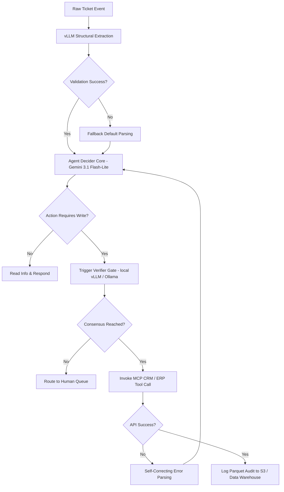

# SyncOps AI — Event-Driven Enterprise Agent for Support & Order Fulfillment

> An event-driven LLM agent platform that automates customer support tickets and order fulfillment. Reads incoming requests, queries internal knowledge bases, decides on resolutions, updates mock enterprise CRM/ERP systems, logs execution details to a Data Warehouse, and monitors performance with full cloud-scale observability.

---

## Table of Contents

1. [Problem Statement](#problem-statement)
2. [Solution Overview](#solution-overview)
3. [Novelty Hooks](#novelty-hooks)
4. [Core Features](#core-features)
5. [System Architecture](#system-architecture)
6. [Technology Stack](#technology-stack)
7. [Project Structure](#project-structure)
8. [Phase-by-Phase Build Plan](#phase-by-phase-build-plan)
9. [Redpanda (Kafka) Event Design](#redpanda-kafka-event-design)
10. [Kubernetes Deployment](#kubernetes-deployment)
11. [Terraform Infrastructure](#terraform-infrastructure)
12. [CI/CD Pipeline](#cicd-pipeline)
13. [Prometheus (OpenTelemetry) Observability](#prometheus-opentelemetry-observability)
14. [vLLM & Ollama Local Serving](#vllm--ollama-local-serving)
15. [Pytest Integration & Testing Strategy](#pytest-integration--testing-strategy)
16. [AWS Deployment](#aws-deployment)
17. [Agent Execution & Decision Loop](#agent-execution--decision-loop)
18. [Resume Keywords Coverage](#resume-keywords-coverage)
19. [Success Criteria](#success-criteria)

---

## Problem Statement

Enterprise customer operations and order management are highly manual and expensive. Teams spend hours copy-pasting data between messy customer emails, Customer Relationship Management (CRM) databases, and Enterprise Resource Planning (ERP) shipping systems.

Common problems in legacy automation:
- **API Race Conditions & Retries**: Simple scripts fail when external systems go offline or reject updates.
- **Hallucinations on Data Write**: Standard LLM integrations can make incorrect updates to shipping quantities or database records.
- **Lack of Audit Trails**: Businesses cannot verify why an AI decided to execute a specific refund or address change.
- **High Operational Costs**: Running heavy servers and paying expensive LLM providers 24/7 drains budget.

SyncOps AI solves these issues by creating a secure, event-driven, dual-verification agent pipeline that automates CRM and ERP updates, uses local open-source models for cheap text parsing, and records every step to an analytical data lake for complete auditing.

---

## Solution Overview

SyncOps AI orchestrates multiple cloud and AI systems to handle customer tasks autonomously:
- **Serverless Ingestion & Semantic Routing**: Customer tickets trigger **AWS Lambda**, which acts as a Semantic Router. It routes incoming requests into prioritized Kafka topics based on classification risk (e.g., critical writes vs. standard updates).
- **Asynchronous Processing**: Python consumers pull tickets off specialized Kafka partitions, allowing independent worker scaling.
- **Multi-LLM Decision Core**: The agent uses **Google Gemini 3.1 Flash-Lite** (via standard free-tier API) as the primary decider, with local **vLLM / Ollama** acting as the verifier and extraction core.
- **Zero-Schema vLLM Extraction**: A local **vLLM / Ollama** engine utilizes guided decoding (JSON schema constraint sampling via **Outlines**) to guarantee 100% syntactically valid parameter extraction.
- **Model Context Protocol (MCP) Integration**: Enterprise system updates are decoupled and executed via a dedicated **Model Context Protocol (MCP)** server (implemented using Python's **FastMCP**). The worker functions as an MCP client over Server-Sent Events (SSE) to invoke mock **CRM** (HubSpot/Salesforce) and **ERP** (SAP/Odoo) tools securely.
- **Idempotency Guard**: Downstream database and tool invocation writes use a deterministic idempotency key derived from Kafka metadata: `SHA256(Topic + Partition + Offset)` to prevent double executions (e.g., double-refunds).
- **Parquet Data Lake**: Execution traces and token metrics are serialized as partitioned **Parquet** files on **AWS S3** (or emulated via **LocalStack**) and queried locally for zero cost using **DuckDB** (acting as our lightweight local **Data Warehouse**).
- **GitOps & Observability**: Managed via **Terraform**, deployed on **Kubernetes**, and instrumented with **OpenTelemetry** (using GenAI Semantic Conventions) and Prometheus.

---

## Novelty Hooks

### Hook 1: Self-Correcting Multi-Step Tool Execution Loop
If the AI agent calls the mock CRM or ERP system and receives an API validation error (e.g. *"invalid warehouse code"* or *"insufficient stock"*), it does not crash or escalate to a human. Instead, it reads the raw API error payload, updates its internal context, plans a fallback strategy, and automatically resubmits a corrected call.

### Hook 2: Dual-Model Consensus Verification Gate
Before executing high-risk actions (such as triggering an order refund or archiving a customer deal), a verification gate is triggered. The primary decider (**Google Gemini 3.1 Flash-Lite**) must agree on the refund calculation and reason with the verifier running locally (**vLLM / Ollama** running Gemma 4 E4B). If there is a disagreement, the transaction is suspended and routed to a human-in-the-loop review queue.

### Hook 3: Deterministic Kafka-Coordinates Idempotency (Double-Refund Protection)
To protect against network dropouts during retry loops, the platform generates a unique, deterministic idempotency key for every action based on the consumer metadata: `SHA256(Topic + Partition + Offset)`. If the ERP/CRM database encounters the same key within a 15-minute window, it suppresses duplicate execution and returns the cached result.

### Hook 4: Guided Token Sampling (Zero-Schema Failures)
Instead of relying on raw prompting for JSON extraction, the local **vLLM** engine employs guided decoding. By integrating with libraries like **Outlines**, the model is constrained at the token selection level to only sample tokens that conform to the target Pydantic schema, guaranteeing syntactically valid outputs.

---

## Core Features

### 1. Event Ingestion & Semantic Routing
When a support ticket is uploaded to an S3 bucket, an **AWS Lambda** function is triggered. The Lambda performs semantic routing (using regex token parsing or a fast classifier) to classify the ticket's intent (e.g., critical refund vs. standard address update) and publishes the ticket to the corresponding topic queue (`tickets-critical-write` or `tickets-standard-update`) on **Redpanda/Kafka**.

### 2. FastMCP CRM & ERP Server
To safely and standardizedly interact with downstream services, the application implements a dedicated **Model Context Protocol (MCP)** server:
- **SyncOps ERP CRM Server**: Built with Python's **FastMCP** framework and mounted on FastAPI via SSE (`/mcp/sse`).
- **MCP Client Session**: The consumer worker establishes a persistent SSE connection (`mcp.client.sse.sse_client`) and session to dynamically retrieve and invoke ERP and CRM tools.
- **Exposed MCP Tools**:
  - `check_inventory`: Verifies item stock levels across warehouses.
  - `modify_order_address`: Updates delivery addresses (with idempotency check).
  - `generate_invoice`: Generates billing invoices.
  - `process_return`: Processes returns for delivered items.
  - `get_customer_profile`: Fetches CRM customer profile metadata.
  - `modify_deal_stage`: Moves sales opportunity stages.
  - `upgrade_customer_tier`: Modifies account tiers.

### 3. Structural Extraction Engine (vLLM / Ollama)
To avoid high LLM API costs, the system routes raw text to a quantized model (e.g. Gemma 4 E4B) served via **vLLM on Google Colab** (exposing it via ngrok) or **Ollama locally on CPU**. Using guided decoding, the model is mathematically restricted to outputting JSON that matches the strict Pydantic schemas for order details, customer IDs, and request parameters.

### 4. Data Warehouse & Analytics Exporter (DuckDB + Parquet)
Upon resolving a ticket, a background consumer serializes the agent's full reasoning chain, token usage, API response times, and final outcome to **Apache Parquet** format. The Parquet file is pushed to an S3 data lake (or emulated LocalStack S3) using a time-partitioned layout:
```
s3://syncops-data-lake/audit/year=YYYY/month=MM/day=DD/ticket_id=UUID.parquet
```
To query these logs without running a paid data warehouse (like Snowflake), the system integrates **DuckDB**. DuckDB runs directly in Python to execute fast SQL analytical queries over these S3 Parquet files at zero cost.

---

## System Architecture

```
                                [ Customer Ticket / Webhook ]
                                              │
                                              ▼
                                   ┌──────────────────────┐
                                   │   S3 Ingest Bucket   │
                                   └──────────┬───────────┘
                                              │ (S3 Event)
                                              ▼
                                   ┌──────────────────────┐
                                   │  AWS Lambda Trigger  │
                                   └──────────┬───────────┘
                                              │
                                              ▼
┌──────────────────────────────────────────────────────────────────────────────────────┐
│ Kubernetes Cluster (K3s on EC2 / K3d Local)                                          │
│                                                                                      │
│                                ┌──────────────────┐                                  │
│                                │ FastAPI Gateway  │                                  │
│                                └────────┬─────────┘                                  │
│                                         │                                            │
│                                         ▼                                            │
│                                ┌──────────────────┐                                  │
│                                │ Redpanda Broker  │ <── (Kafka API)                  │
│                                └────────┬─────────┘                                  │
│                                         │                                            │
│                ┌────────────────────────┼────────────────────────┐                   │
│                ▼                        ▼                        ▼                   │
│         ┌──────────────┐         ┌──────────────┐         ┌──────────────┐           │
│         │ Ticket Worker│         │ Audit Worker │         │ Alert Worker │           │
│         └──────┬───────┘         └──────┬───────┘         └──────────────┘           │
│                │                        │                                            │
│       (OTel)   ▼                        ▼                                            │
│  ┌───────────────────────────┐   ┌──────────────┐                                    │
│  │ OpenTelemetry Collector   │   │  AWS S3      │                                    │
│  └──────┬─────────────┬──────┘   │  (DW Parquet)│                                    │
│         │             │          └──────────────┘                                    │
│         ▼             ▼                                                              │
│  ┌────────────┐  ┌───────────┐                                                       │
│  │ Prometheus │  │ Langfuse  │                                                       │
│  └────────────┘  └───────────┘                                                       │
└──────────────────────────────────────────────────────────────────────────────────────┘
        │
        ├──────────────────────────┬──────────────────────────┐
        ▼                          ▼                          ▼
  ┌──────────────┐           ┌──────────────┐           ┌──────────────┐
  │Gemini 3.1    │           │ vLLM / Ollama│           │   DuckDB     │
  │  Flash-Lite  │           │ (Extractor/  │           │ (Analytics/  │
  │(Decider Core)│           │  Verifier)   │           │  Query Eng)  │
  │(Free API SDK)│           │              │           │              │
  └──────────────┘           └──────────────┘           └──────────────┘
```

---

## Technology Stack

### Backend & AI Layer
- **FastAPI (Python 3.11)**: Async REST API layer with Pydantic v2 schemas.
- **Model Context Protocol (MCP)**: Implemented using Python's **FastMCP** to standardizedly expose CRM/ERP operations as tools, consumed via an SSE client (`sse_client`).
- **Google Gemini 3.1 Flash-Lite (Free Tier API)**: Principal decider client.
- **vLLM / Ollama**: Structural entity extraction and verification served via Colab (GPU) or Ollama (CPU).
- **SQLAlchemy + PostgreSQL 15**: Containerized database (self-hosted locally / in K8s, replacing managed cloud RDS) for metadata and metrics logging.
- **DuckDB**: Embedded database client used to run local analytics directly over S3/LocalStack Parquet files.

### Serverless & Messaging Ingestion
- **AWS Lambda (Python)**: Serverless function executing on S3 events to ingest raw support tickets, extract metadata, and publish payloads to Redpanda.
- **Redpanda**: High-performance, low-memory C++ messaging broker implementing the Apache Kafka protocol.
- **AWS S3**: High-availability storage hosting partitioned Parquet traces, test benchmarks, and PDF reports.
- **AWS DynamoDB**: Distributed lock manager table utilized for Terraform state locking.

### DevOps & Infrastructure
- **Terraform**: Infrastructure-as-code scripts managing all AWS networking, EC2 clusters, S3 buckets, and Lambda triggers.
- **Kubernetes (K3d Local, K3s on EC2 `t3.micro`)**: Container orchestration.
- **LocalStack**: Local sandbox environment to emulate AWS Lambda, S3, ECR, and DynamoDB offline for free.
- **GitHub Actions**: Automated CI/CD pipeline executing testing, Docker builds, and ephemeral staging runs.
- **Pytest + Testcontainers**: Integration tests verifying database and queue states.

---

## Project Structure

```
syncops-ai/
├── backend/
│   ├── app/
│   │   ├── main.py                  # FastAPI server
│   │   ├── routers/                 # API controllers
│   │   ├── services/
│   │   │   ├── agent_core.py        # Decider loop (Google Gemini API)
│   │   │   ├── verifier_gate.py     # Verification gate (vLLM / Ollama)
│   │   │   ├── mcp_server.py        # FastMCP Server definition (SyncOps ERP CRM)
│   │   │   ├── mock_crm_erp.py      # Mock Salesforce/SAP API endpoints
│   │   │   ├── extraction.py        # vLLM/Ollama structural parser
│   │   │   └── dw_exporter.py       # Parquet serializer & S3 exporter
│   │   ├── kafka/
│   │   │   ├── producer.py
│   │   │   └── consumers/
│   │   │       ├── ticket_consumer.py
│   │   │       └── audit_consumer.py  # Handles trace packaging and S3 write
│   │   ├── db.py
│   │   └── telemetry.py             # OpenTelemetry setup
│   │
│   └── tests/
│       ├── conftest.py              # Test containers (Redpanda, DB) + LocalStack
│       ├── test_agent_core.py       # Decider loop checks
│       ├── test_mock_crm_erp.py     # API validation checks
│       └── ...
│
├── lambda/
│   └── ticket_ingest/
│       └── index.py                 # Lambda code (reads ticket, triggers Redpanda)
│
├── infra/
│   ├── terraform/
│   │   ├── backend.tf               # S3 & DynamoDB backend setup
│   │   ├── main.tf                  # Root IaC module
│   │   ├── modules/
│   │   │   ├── lambda/              # Lambda setup
│   │   │   ├── vpc/ │ ec2/ │ s3/ │ ecr/
│   │   │   └── dynamodb/            # DynamoDB for locking
│   │   └── scripts/
│   │       └── deploy-ephemeral.sh  # Script to spin up, test, and destroy staging
│   │
│   ├── k8s/
│   │   ├── helm/
│   │   └── manifests/
│   │
│   └── docker/
│       ├── docker-compose.yml       # Local development
│       └── Dockerfile
│
├── colab/
│   └── extraction_server.ipynb      # Google Colab vLLM server
│
└── README.md
```

---

## Phase-by-Phase Build Plan

### Phase 1 — Sandbox & Extraction Engine
**Keywords**: FastAPI, Pytest, vLLM, Ollama, CRM, ERP, Postgres
- Build the mock CRM and ERP endpoints to act as the target sandbox.
- Implement the structured extraction client parsing messy emails into clean JSON.
- Create the local fallback routing to Ollama on CPU.
- Implement Pytest suite testing the parsing logic with mocked APIs.
- Configure GitHub Actions to check code formatting and verify test runs.

### Phase 2 — Event-Driven Architecture (Redpanda)
**Keywords**: Redpanda, Apache Kafka, OpenTelemetry, Prometheus
- Set up Redpanda in Docker Compose.
- Write FastAPI consumers listening to `incoming-tickets` and `audit-logs` topics.
- Instrument consumers and API endpoints with OpenTelemetry SDK.
- Configure the OTel Collector to scrape traces and pipe metrics to Prometheus.

### Phase 3 — Serverless, Data Lake & DuckDB
**Keywords**: AWS Lambda, AWS S3, Parquet, LocalStack, DuckDB
- Configure S3 file ingestion setup. Integrate `dw_exporter.py` to write finished traces to S3 in partitioned Parquet files.
- Launch LocalStack locally; verify S3 storage and ECR registry function offline.
- Integrate **DuckDB** as the analytical database client to query S3 Parquet files directly.
- Author the ticket ingest Lambda function in `/lambda/ticket_ingest` and test it using LocalStack.

### Phase 4 — Terraform & Ephemeral Deployments
**Keywords**: Terraform, AWS (S3, EC2, ECR, DynamoDB), Kubernetes (K3s, self-hosted PostgreSQL), CI/CD
- Write Terraform scripts for the AWS environment (VPC, S3, EC2, ECR, DynamoDB backend).
- Create Kubernetes manifests for self-hosted PostgreSQL with persistent volume mounts, eliminating managed RDS.
- Write `/infra/scripts/deploy-ephemeral.sh` to automate provisioning on AWS Free Tier, deploy K3s with self-hosted PostgreSQL and Redpanda, run the SyncOps pipeline, verify trace uploads, and run `terraform destroy`.
- Configure CI/CD actions to deploy to staging on merge.

### Phase 5 — Dual-Model Agreement Core
**Keywords**: Google Gemini API, vLLM / Ollama, Agent Loop
- Implement the decider-agent loop in `agent_core.py` using Google Gemini 3.1 Flash-Lite.
- Implement the self-correcting retry loop for tool calling.
- Add the consensus check verifier gate using local vLLM / Ollama (Gemma 4 E4B).

---

## Redpanda (Kafka) Event Design

### Message Flows and Schema Topics

| Topic | Producer | Consumer Group | Purpose |
|---|---|---|---|
| `incoming-tickets` | AWS Lambda | `ticket-workers` | Queue raw tickets for agent execution |
| `audit-logs` | Ticket worker | `audit-workers` | Enqueue resolved ticket execution traces for Parquet archiving |
| `alerts` | Ticket worker | `alert-service` | Route high-value disputes to operator slack |

---

## Kubernetes Deployment

### Local Kubernetes Setup (K3d)
Use **K3d** to run a lightweight K8s cluster directly inside Docker on your laptop.
```bash
# Spin up local cluster
k3d cluster create syncops --port "8080:80@loadbalancer" --agents 2
```

### Production Cluster (K3s on EC2 Free Tier)
Deploy K3s on a single free-tier `t3.micro` instance. Use Swap memory (`2GB`) on the instance to guarantee K3s runs smoothly alongside PostgreSQL and Redpanda without triggering OOM crashes.

---

## Terraform Infrastructure

### Ephemeral Lifecycle Execution Flow
To execute staging deployment for free, the deployment script automates this process:
```bash
# 1. Spin up AWS Staging resources
cd infra/terraform
terraform init
terraform apply -auto-approve

# 2. Build and Deploy
docker build -t syncops-api ../../backend
docker tag syncops-api $(terraform output -raw ecr_endpoint):latest
docker push $(terraform output -raw ecr_endpoint):latest
helm upgrade --install syncops ../k8s/helm/syncops-api --set image.tag=latest

# 3. Trigger test benchmarks & verify analytical pipeline output

# 4. Tear down infrastructure immediately
terraform destroy -auto-approve
```

---

## CI/CD Pipeline

The project implements a complete GitOps workflow via GitHub Actions to automate code validation and infrastructure lifecycle management.

### GitHub Actions Workflow Jobs

1. **Lint & Test Gateway (`lint-and-test`)**:
   - Executes linting via `flake8` and code formatting via `black` / `ruff`.
   - Spins up Postgres and Redpanda services as Docker containers.
   - Triggers `pytest` for unit and integration testing.
   - Enforces a minimum code coverage threshold of **80%**.

2. **Docker Build & Push (`build-images`)**:
   - Triggered only upon successful completion of testing and linting.
   - Builds Docker images for the FastAPI server, asynchronous workers, and frontend code.
   - Tags images with the Git commit SHA and pushes them to the local registry (in staging/dev) or Amazon Elastic Container Registry (Amazon ECR).

3. **Terraform Validation (`terraform-ci`)**:
   - Executes `terraform init`, `terraform fmt -check`, and `terraform validate`.
   - Runs a `terraform plan` against the target workspace to verify security groups and IAM resource boundaries before any changes are merged.

4. **Ephemeral Staging Exec (`ephemeral-verify`)**:
   - Triggers on merges to `main`.
   - Invokes `deploy-ephemeral.sh` to provision VPC, EC2, S3, and ECR resources (using a self-hosted PostgreSQL pod inside K8s instead of paid RDS).
   - Deploys the FastAPI server, self-hosted PostgreSQL, and worker tasks via Helm.
   - Executes E2E pipeline verification (S3 upload trigger -> Redpanda -> dual-model consensus check -> Parquet database export -> DuckDB analytics query validation).
   - Runs `terraform destroy` immediately after run validation to maintain a **$0 AWS balance**.

---

## Prometheus (OpenTelemetry) Observability

Application metrics are collected via OpenTelemetry APIs, received by the OTel Collector, and parsed into Prometheus.

### Standardized OTel Metrics

| Metric Name | Instrument | Label / Dimension | Target SLA |
|---|---|---|---|
| `ticket_processing_seconds` | Histogram | `intent`, `status` | p95 < 5.0s |
| `automation_rate` | Gauge | `account_tier` | > 85% |
| `tool_failure_rate` | Gauge | `api_endpoint` | < 1% |
| `dw_export_duration_seconds`| Histogram | `ticket_id` | < 5s |
| `queue_lag_messages` | Gauge | `topic` | < 50 |

---

## vLLM & Ollama Local Serving

### Google Colab vLLM Server (Free GPU Staging)
Exposed via ngrok as an OpenAI-compatible completion endpoint:
```python
# Serving command in Colab
!python -m vllm.entrypoints.openai.api_server \
    --model google/gemma-4-e4b \
    --port 8000 \
    --max-model-len 2048
```

### Ollama Local Server (Free Offline CPU Dev)
When running offline or without Colab, the engine routes to local Ollama served on CPU:
```bash
# Pull and serve a quantized model locally
ollama pull gemma4:e4b
ollama serve
```

---

## Pytest Integration & Testing Strategy

### Test Layout
- `tests/test_agent_core.py`: Verifies mock ERP (SAP) and CRM (Salesforce) tool invocation.
- `tests/test_dw_exporter.py`: Validates Parquet schema compliance, S3 writes via LocalStack, and DuckDB analytical query execution.
- `tests/test_extraction.py`: Uses `pytest-mock` to test Gemini API calls and local extraction logic without making network requests.

```python
# Example Gemini API client mock test
@pytest.mark.asyncio
async def test_gemini_agent_decision(mocker):
    # Mock google-generativeai client call
    mock_model = mocker.patch("google.generativeai.GenerativeModel")
    mock_response = mocker.Mock()
    mock_response.text = '{"decision": "Update Address", "parameters": {"street": "10 Main St"}}'
    mock_model.return_value.generate_content.return_value = mock_response
    
    # Run agent decision loop logic
    result = await make_gemini_decision("london-ticket", "Process address change request.")
    assert result["decision"] == "Update Address"
```

---

## AWS Deployment

The staging architecture is hosted on AWS Free Tier, optimized for zero cost using short-lived workspaces and local emulator setups.

### AWS Resource Topology

- **Amazon EC2**: Runs a single `t3.micro` instance hosting K3s. A `2GB` Swap space configuration ensures Kubernetes controls, Redpanda brokers, PostgreSQL DBs, and the OTel Collector run concurrently without triggering Out-Of-Memory (OOM) alerts.
- **Amazon S3**: High-availability object storage hosting three target buckets:
  - `syncops-benchmarks`: Uploading test datasets here triggers Lambda evaluation routines.
  - `syncops-reports`: Storing final evaluation summaries and PDF charts.
  - `syncops-data-lake`: Emitting time-partitioned Parquet trace folders.
  - *Lifecycle Rule*: Configured in Terraform to automatically transition raw parquet trace directories to Glacier Deep Archive after 30 days to limit active storage size.
- **AWS Lambda**: A Python-based serverless trigger executing on S3 `ObjectCreated` events. It intercepts uploads, reads metadata headers, and sends evaluation jobs directly to Redpanda via Kafka API clients.
- **Self-Hosted PostgreSQL**: Deployed directly inside K3s with local persistent volumes, eliminating the cost of Amazon RDS while maintaining DB functionality.
- **Amazon ECR**: Container registry holding tagged FastAPI and worker Docker images.
- **Amazon DynamoDB**: Locking database utilised for Terraform state consistency (`lock_id`) (emulated locally via LocalStack for development).
- **AWS IAM**: Fine-grained access roles authorizing local workloads via OpenID Connect (OIDC) security groups.

---

## Agent Execution & Decision Loop



---

## Resume Keywords Coverage

This project structure directly validates your experience with:

| Domain | Keyword | Practical Usage in SyncOps AI |
|:---|:---|:---|
| **AI Layer** | **vLLM** | Serves Gemma 4 E4B on Colab for high-throughput structural ticket extraction. |
| | **Google Gemini** | Primary decider model (Gemini 3.1 Flash-Lite) invoked via the Google AI Studio free tier. |
| | **Ollama** | Local CPU-bound model execution fallback for offline development. |
| | **MCP** | Model Context Protocol integration using FastMCP to standardizedly expose CRM/ERP operations as tools. |
| **DevOps & Infra**| **Kubernetes** | Local cluster orchestration via K3d; K3s deployment hosted on AWS EC2 with self-hosted DB. |
| | **Terraform** | IaC architecture for S3, ECR, VPC, Lambda, and DynamoDB backend (no RDS). |
| | **CI/CD** | GitHub Actions workflows executing Pytest, LocalStack tests, and Docker builds. |
| | **AWS Lambda** | Serverless function acting as S3 file upload trigger to automate runs. |
| | **AWS Services** | Real-world usage of EC2, S3, ECR, and IAM least-privilege roles. |
| **Data & Messaging**| **Apache Kafka** | Event-driven architecture utilizing **Redpanda** (Kafka API compatible). |
| | **Data Warehouse / Analytics**| Time-partitioned Parquet files on S3 queried at zero-cost using **DuckDB**. |
| | **PostgreSQL** | Self-hosted storage engine running in a container, housing system configs and audit records. |
| **Observability** | **Prometheus** | System health and execution metrics scraped via OTel Collector pipelines. |
| | **Pytest** | Testing framework with strict $\ge 80\%$ code coverage goals. |
| **Enterprise Integrations** | **CRM** | Benchmarking tool calling against mock CRM (Salesforce/HubSpot) schemas. |
| | **ERP** | Benchmarking tool calling against mock ERP (SAP/Odoo) schemas. |

---

## Success Criteria

| Milestone | Objective |
| :--- | :--- |
| **Phase 1 Complete** | API starts successfully, mocks CRM/ERP responses, parses text, and passes Pytest suites. |
| **Phase 2 Complete** | Ticket events publish and process via Redpanda queue with OpenTelemetry instrumentation. |
| **Phase 3 Complete** | Lambda trigger intercepts local S3 uploads on LocalStack and triggers consumers; Parquet logs write to S3 and query successfully via DuckDB. |
| **Phase 4 Complete** | `deploy-ephemeral.sh` successfully provisions, runs E2E pipeline with self-hosted PostgreSQL, and destroys AWS staging environment. |
| **Phase 5 Complete** | Dual-agreement (Gemini + local vLLM/Ollama) and self-correcting tool call execution run successfully. |
